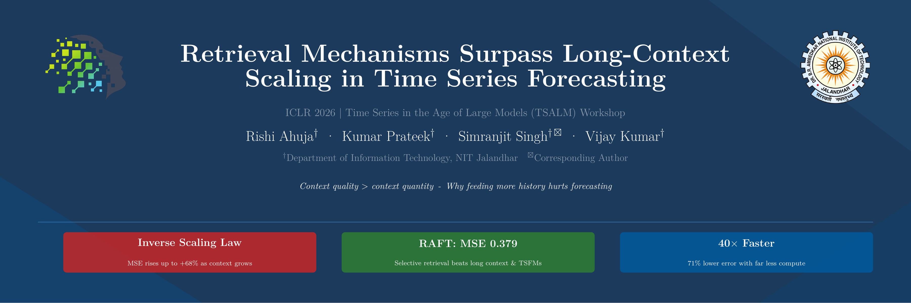

<p align="center">
  
</p>

# Retrieval Mechanisms Surpass Long-Context Scaling in Time Series Forecasting

[](https://openreview.net/forum?id=Qj96MlCmZw)
[](LICENSE)
[](https://tsalm-workshop.github.io/)

**Accepted as Poster at [ICLR 2026 TSALM Workshop](https://tsalm-workshop.github.io/)**
(1st ICLR Workshop on Time Series in the Age of Large Models)

[Rishi Ahuja](https://rishia.in/research) · [Kumar Prateek](https://scholar.google.com/citations?user=yBNfbLwAAAAJ) · [Simranjit Singh](https://scholar.google.co.in/citations?user=uVD29RwAAAAJ&hl=en) · [Vijay Kumar](https://scholar.google.com/citations?user=kviNdloAAAAJ&hl=en&authuser=1)

Department of Information Technology, Dr. B.R. Ambedkar National Institute of Technology Jalandhar

[[Paper]](paper/paper.tex) · [[OpenReview]](https://openreview.net/forum?id=Qj96MlCmZw) · [[Homepage]](https://rishia.in/research)

---

> **TL;DR:** Longer context windows *hurt* time series forecasting — we show an inverse scaling law where error rises up to 68% with more history, and demonstrate that retrieval-augmented forecasting (RAFT) beats both long-context models and foundation models while being 40× faster.

## Abstract

Time Series Foundation Models (TSFMs) have borrowed the long context paradigm from natural language processing under the premise that feeding more history into the model improves forecast quality. But in stochastic domains, distant history is often just high-frequency noise, not signal. This work tests whether this premise actually holds by running continuous context architectures (including PatchTST) through the ETTh1 benchmark. The results contradict the premise: an inverse scaling law shows up clearly, with forecasting error rising as context gets longer. A 3,000-step window can cause performance to drop by up to 68%, evidence that attention mechanisms are poor at ignoring irrelevant historical volatility. Retrieval-Augmented Forecasting (RAFT) is evaluated as an alternative. RAFT achieves a mean squared error (MSE) of 0.379 with a fixed 720-step window and selective retrieval, outperforming both long-context configurations and zero-shot foundation models (Chronos, Moirai) despite requiring far less computation. Retrieved segments function as dynamic exogenous variables that provide context-informed inductive bias without the noise penalties attached to long continuous windows.

## About This Repository

This repository contains the full experimental code and analysis for the paper. It is a **comparison study** — the paper evaluates existing architectures (PatchTST, Vanilla Transformers, Chronos, Moirai) alongside the RAFT method proposed by [Han et al. (2025)](https://github.com/junhyukOh/RAFT) to investigate the failure of long-context scaling in stochastic time series forecasting. The RAFT model implementation included here is adapted from the original RAFT codebase; it is not a novel architecture contribution of this work.

The code is organized around two entry points. `run.py` handles RAFT and PatchTST experiments through a standard argument parser — you can configure the model, dataset, context length, prediction horizon, and all hyperparameters from the command line. `run_long_context.py` serves the same purpose for the Vanilla Transformer long-context baseline. Both scripts handle training, validation, and test evaluation in a single run.

Model definitions live under `models/`, with `RAFT.py` implementing the retrieval-augmented forecasting transformer, `PatchTST.py` providing the patched channel-independent transformer, and `TransformerLongContext.py` containing the vanilla long-context encoder–decoder. The retrieval mechanism — periodicity-aware DTW matching and cosine similarity selection — is implemented in `layers/Retrieval.py`. Data loading for the ETT benchmarks is handled by `data_provider/`, and shared utilities (metrics, DTW, augmentation, training logging) are in `utils/`.

The `experiments/` directory contains self-contained scripts that reproduce the camera-ready analyses: multi-horizon evaluation across prediction lengths 96, 336, and 720; zero-shot evaluation of Chronos and Moirai foundation models; attention entropy measurements that quantify the dilution effect; and corrected PatchTST baselines with proper hyperparameters from the original paper. Each script can be run independently and writes results to `experiments/results/`.

Shell scripts under `scripts/` automate full reproduction. `scripts/run_main_experiments.sh` runs all core experiments sequentially, and `scripts/download_data.sh` fetches the ETT datasets if they are not already present. The ETTh1 and ETTh2 datasets are included in `data/ETT/` for convenience.

## Getting Started

```bash
git clone https://github.com/RishiAhuja/ahuja2026retrieval.git
cd ahuja2026retrieval
pip install -r requirements.txt
bash scripts/run_main_experiments.sh
```

## Citation

```bibtex
@inproceedings{ahuja2026retrieval,
    title={Retrieval Mechanisms Surpass Long-Context Scaling in Time Series Forecasting},
    author={Rishi Ahuja and Kumar Prateek and Simranjit Singh and Vijay Kumar},
    booktitle={1st ICLR Workshop on Time Series in the Age of Large Models},
    year={2026},
    url={https://openreview.net/forum?id=Qj96MlCmZw}
}
```

## License

MIT — see [LICENSE](LICENSE) for details. Portions of this codebase are derived from [RAFT](https://github.com/archon159/RAFT) by Seungeon Lee.
